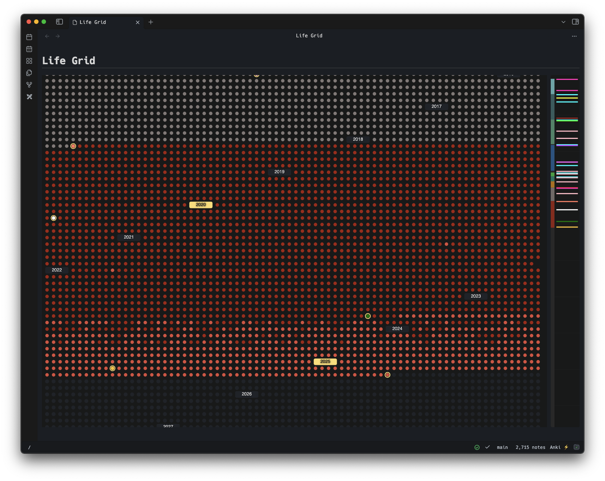

# Obsidian Life Grid



An [Obsidian](https://obsidian.md/) plugin to visualize your entire life as an interactive grid, where each dot represents a day of your existence (whether it's real or simulated).

Track your journey, highlight important milestones, and gain perspective on how you're spending the time you have. Perfect for anyone who enjoys a mild existential crisis with their morning notes.

Entirely vibe-coded, so thank you, Claude!

## ✨ Features

### 📅 **Life Visualization**

-   **Daily Dots**: Every day of your life is represented as a dot in a beautiful grid
-   **Age Display**: Hover over any day to see your exact age at that moment
-   **Today Highlight**: Current day is highlighted with a special border
-   **Automatic Scrolling**: Grid automatically centers on today when opened

### 📝 **Daily Notes Integration**

-   **Note Detection**: Days with daily notes are automatically highlighted in green
-   **Seamless Navigation**: Click any day to open or create a daily note
-   **Custom Colors**: Override default colors using frontmatter in your daily notes

### 🎯 **Life Periods**

-   **Background Coloring**: Define colored periods for different life phases
-   **Flexible Ranges**: Set start and end dates, or use "present" for ongoing periods
-   **Period Labels**: Add meaningful labels like "Childhood", "University", "Career"
-   **Visual Organization**: Easily see how your life has been structured

### 🌟 **Special Events & Milestones**

-   **Event Highlighting**: Mark special days with custom colors and event names
-   **Milestone Tooltips**: Rich tooltips show event details when you hover
-   **Event Borders**: Important events get special visual treatment
-   **Minimap Events**: See all your events at a glance in the sidebar minimap

### 🗺️ **Interactive Minimap**

-   **Decade Markers**: Visual guides show decade boundaries
-   **Event Overview**: All special events are displayed as lines on the timeline
-   **Quick Navigation**: Click to jump to different periods of your life
-   **Proportional Scaling**: Adapts to your screen size

### 🎨 **Beautiful Design**

-   **Dark Theme Optimized**: Designed to work perfectly with Obsidian's dark theme
-   **Responsive Layout**: Adapts to different screen sizes and window dimensions
-   **Smooth Interactions**: Optimized performance with spatial indexing for fast tooltips
-   **Year Headers**: Clear visual separation with highlighted milestone years (every 5 years)

## 🚀 Getting Started

### Requirements

-   **Desktop Only**: This plugin is designed for desktop use and requires a mouse for optimal interaction with hover tooltips and precise clicking.

### Installation

1. Open Obsidian and navigate to `Settings > Community Plugins`.
2. Search for "Life Grid" and click `Install`.
3. Enable the plugin in the `Installed Plugins` section.

### Initial Setup

1. **Set Your Birthday**:

    - Go to Settings → Community Plugins → Life Grid
    - Enter your birthday in YYYY-MM-DD format (e.g., `1990-05-15`)

2. **Adjust Maximum Age** (optional):

    - Default is 95 years
    - Adjust based on your preference for how far to project

3. **Open Life Grid View**:
    - Use command palette: `Ctrl/Cmd + P` → "Open Life Grid"
    - Or use the ribbon icon (if enabled)

## 📖 Usage Guide

### Daily Notes Integration

The plugin automatically detects daily notes (by default in `YYYY-MM-DD` format, but this is configurable). Days with notes appear in green if no other color has been defined for the current period, making it easy to see your journaling consistency.

### Adding Special Events

To mark special events, add frontmatter to your daily notes:

```yaml
---
color: "#ff6b6b"
eventName: "Graduated from University"
---
# 2015-06-15

Today I graduated!
```

### Configuring Life Periods

Life periods help you visualize different phases of your life:

1. **Open Settings**: Go to Settings → Community Plugins → Life Grid
2. **Add New Period**: Click "+ Add New Period"
3. **Configure Period**:
    - **Label**: e.g., "University Years"
    - **Start Date**: `2011-09-01`
    - **End Date**: `2015-06-15` (or "present" for ongoing)
    - **Color**: Choose a background color

### Navigation & Interaction

-   **Hover**: See age, date, and event information
-   **Click**: Open or create daily notes
-   **Scroll**: Navigate through your life timeline
-   **Minimap**: Use the right sidebar for quick navigation

## ⚙️ Configuration

### Settings Panel

Access all settings through Settings → Community Plugins → Life Grid:

-   **Birthday**: Your birth date (required)
-   **Maximum Age**: How many years to display (default: 95)
-   **Life Periods**: Define colored background periods
-   **Advanced JSON**: Direct JSON editing for power users

### Frontmatter Options

Customize individual days with frontmatter in your daily notes:

```yaml
---
# Custom color for this day
color: "#ff6b6b"

# Event name for special occasions
eventName: "Wedding Day"
---
```

### Period Configuration

```json
{
	"start": "2010-09-01",
	"end": "2014-06-15",
	"color": "#4a90e2",
	"label": "College Years"
}
```

## 💡 Tips & Best Practices

### 🎯 **Getting the Most Value**

-   Set up life periods to see the big picture of your life phases
-   Use consistent daily journaling to see patterns in green dots
-   Mark important events with custom colors and meaningful names
-   Review periodically to gain perspective on time and priorities

### 🎨 **Visual Organization**

-   Use similar color schemes for related periods
-   Choose distinct colors for major life transitions
-   Use the minimap to quickly jump between decades
-   Take advantage of the decade markers for long-term planning

### 📝 **Daily Notes Integration**

-   Establish a consistent daily note naming convention (e.g.: YYYY-MM-DD)
-   Consider adding the Life Grid view to your daily workflow

## 🔧 Advanced Features

### JSON Configuration

For power users, you can directly edit the periods configuration as JSON:

```json
[
	{
		"start": "1990-05-15",
		"end": "2008-06-15",
		"color": "#ffd93d",
		"label": "Childhood & School"
	},
	{
		"start": "2008-09-01",
		"end": "2012-05-15",
		"color": "#4a90e2",
		"label": "University"
	},
	{
		"start": "2012-06-01",
		"end": "present",
		"color": "#50c878",
		"label": "Professional Career"
	}
]
```

### Performance Optimization

The plugin is optimized for performance:

-   Spatial indexing for fast tooltip detection
-   Batch SVG rendering for smooth scrolling
-   Efficient event handling for large date ranges

## 🚀 Installation

1. Open Obsidian and navigate to `Settings > Community Plugins`.
2. Search for "Life Grid" and click `Install`.
3. Enable the plugin in the `Installed Plugins` section.

## 🤝 Contributing

Contributions are welcome! To contribute:

1. Fork the repository on GitHub.
2. Create a new branch for your feature or bug fix.
3. Submit a pull request with a detailed description of your changes.

For major changes, please open an issue first to discuss what you would like to change.

## 📄 License

This project is licensed under the MIT License.

## 🙏 Acknowledgments

Thanks [to GitHub Copilot](https://github.com/features/copilot) for writing all this code. I just wrote prompts.

---

_Remember: Every dot represents a day. Make them count._ ✨
